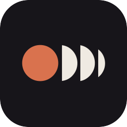
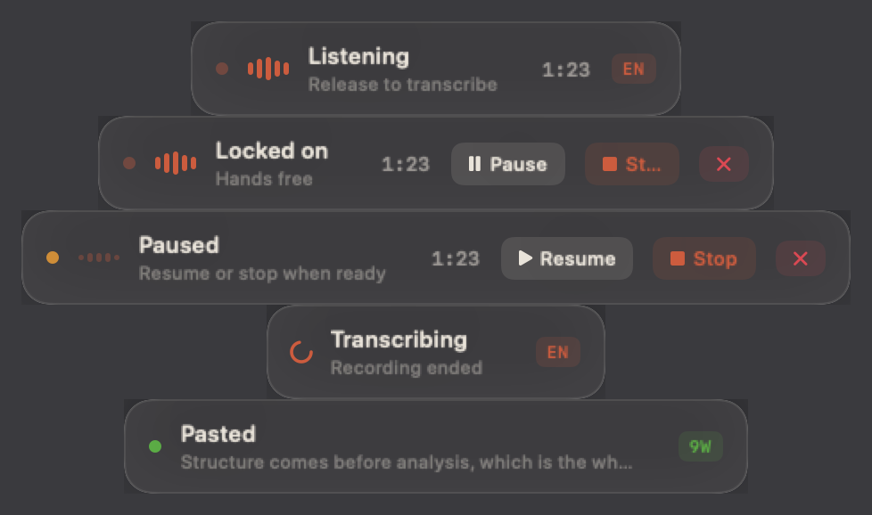

> [!NOTE]
> **Murmur now lives inside [Deck](https://github.com/YahyaElghobashy/deck-mac).**
> Same dictation, same whisper.cpp, same nothing-leaves-your-Mac promise — now sharing a menu bar
> with push-to-talk Alexa control and a desktop widget. The chord moved to **⌃⌥Z**.
> This repository stays up as the standalone app and its history.

<p align="center">
  
</p>

<h1 align="center">Murmur</h1>

<p align="center">
  Push-to-talk dictation for macOS. Hold a key, speak, release.<br>
  The transcript lands where your cursor is. Nothing ever leaves your Mac.
</p>

<p align="center">
  
  
  
  
</p>

<p align="center">
  
</p>

## Why

Cloud dictation tools stream your voice to someone else's servers and charge
you monthly for the privilege. Murmur runs [whisper.cpp](https://github.com/ggml-org/whisper.cpp)
locally: the audio is written to a temporary file, transcribed on your own
silicon, deleted on every code path, and the text is pasted at your cursor.
There is no account, no telemetry, no network access at all.

## Keys

| | |
|---|---|
| **Hold ⌃⌥/** | Record while held, release to transcribe |
| **Double-tap ⌃⌥/** | Lock recording on, hands free |
| **⌃⌥/** again, or **Stop** in the bubble | End a locked run and transcribe |
| **Esc**, or **✕** in the bubble | Cancel and discard the audio |
| **⌃⌥.** | Cycle the primary language |

A locked run shows Pause / Resume, Stop, and Discard controls in the bubble
itself. Pausing suspends capture without splitting the file, so whisper sees
one continuous clip, and the timer tracks audio rather than wall clock.
Typing never ends a locked run; dictate alongside any other work.

## Language

Whisper commits to one language per clip, so naming the dominant one beats
letting it guess on code-switched speech. Three modes cycle with ⌃⌥. :

- **English** — Arabic spoken mid-sentence gets translated
- **Arabic** — Egyptian and MSA; English gets transliterated
- **Auto** — detect per clip

## Where the transcript goes

If whatever has keyboard focus accepts text, it is pasted there without
stealing focus. If not, it lands on the clipboard and the bubble says so.
Either way the clipboard holds it, so a missed paste is a ⌘V away.

## Install

Murmur builds with the Xcode Command Line Tools alone. No Xcode project,
no package manager, no dependencies.

```bash
brew install whisper-cpp
mkdir -p ~/.local/share/whisper-models
curl -L -o ~/.local/share/whisper-models/ggml-large-v3-turbo.bin \
  https://huggingface.co/ggerganov/whisper.cpp/resolve/main/ggml-large-v3-turbo.bin

git clone https://github.com/YahyaElghobashy/murmur.git
cd murmur
./signing/create-identity.sh   # once; see "Signing" below
./build.sh
cp -R build/Murmur.app /Applications/
open /Applications/Murmur.app
```

Grant **Microphone** when asked, and switch Murmur on under
**Privacy & Security → Accessibility**. The app polls for the grant and arms
itself the moment the switch flips.

## Signing, and why it matters

macOS pins Accessibility grants to an app's code signature. An ad-hoc
signature is derived from the binary's contents, so every rebuild would
invalidate the grant, and Settings shows a toggle that reads "on" while the
system ignores it. `signing/create-identity.sh` creates a local self-signed
identity once; `build.sh` then signs with it, the designated requirement
stays constant, and the grant survives rebuilds. The private key never
leaves your login keychain and nothing needs an Apple developer account.

## How it works

```
⌃⌥/  ──▶  CGEventTap        the chord never reaches the focused app
             │
             ▼
       AVAudioEngine        mic tap → AVAudioConverter → 16 kHz mono WAV
             │                        (one temp file, deleted on every path)
             ▼
       whisper-cli          large-v3-turbo, local, ~5× realtime
             │
             ▼
       NSPasteboard + ⌘V    pasted at the cursor when the focused element
                            accepts text; clipboard fallback otherwise
```

Guard rails: clips under 0.4 s are discarded as mis-presses, silent clips are
rejected before whisper spends cycles, recordings cap at two minutes,
transcription is killed at 90 s, and the event tap re-arms itself every five
seconds because macOS disables taps that ever block.

## Privacy

- Audio: one file in the user temporary directory, removed in every exit path
- Network: none; the binary makes no network calls of any kind
- Persistence: language choice, toggles, and a words-dictated counter in
  `UserDefaults`; a launch trace in `~/Library/Logs/murmur.log`

## License

[MIT](LICENSE) © Yahya Elghobashy
